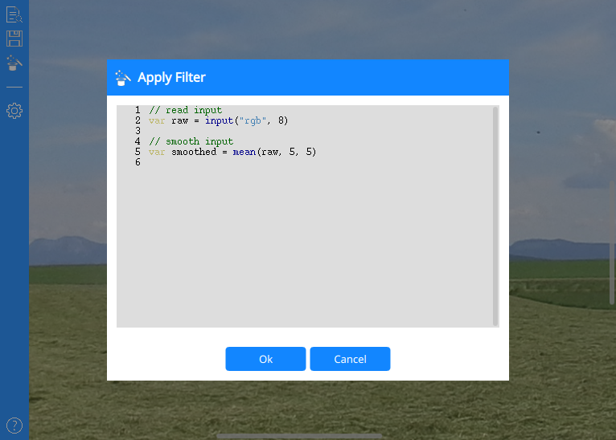

# cv-playground Editor

Graphical user editor for the [cv-playground](https://github.com/franz-alt/cv-playground) library

## Motivation

Playing with different image processing algorithms and have a direct graphical feedback with this editor.

## Planned

* Perform image processing on video streams (via FFmpeg)

## Screenshots

Main Window

Filter Expression Editor

## Building

### Requirements

* C++ 17 compiler
* CMake 3.14 or later

## License

Copyright (c) 2021 Franz Alt

This project is distributed under the [MIT License](https://opensource.org/licenses/MIT), see [LICENSE](./LICENSE.txt) for more information.
